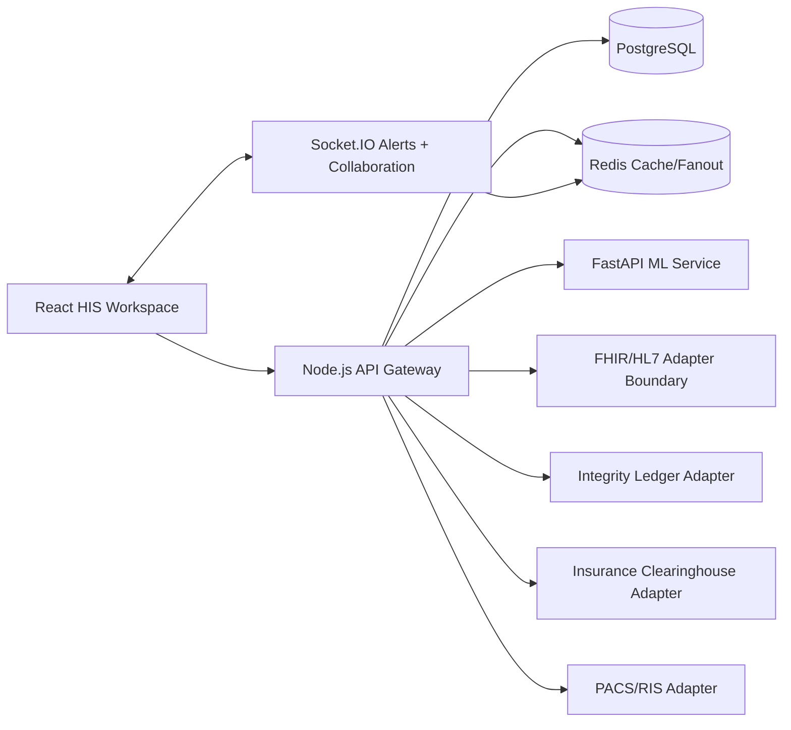

# Architecture Diagram

## Module Boundaries

- Patient life-cycle and EMR
- Scheduling, OPD/IPD queueing, and bed board
- Billing and revenue cycle
- Pharmacy, inventory, and procurement
- LIS/RIS/PACS diagnostics
- Telemedicine and remote care
- Analytics, reporting, AI, and 3D visualization
- Security, audit, consent, and interoperability

